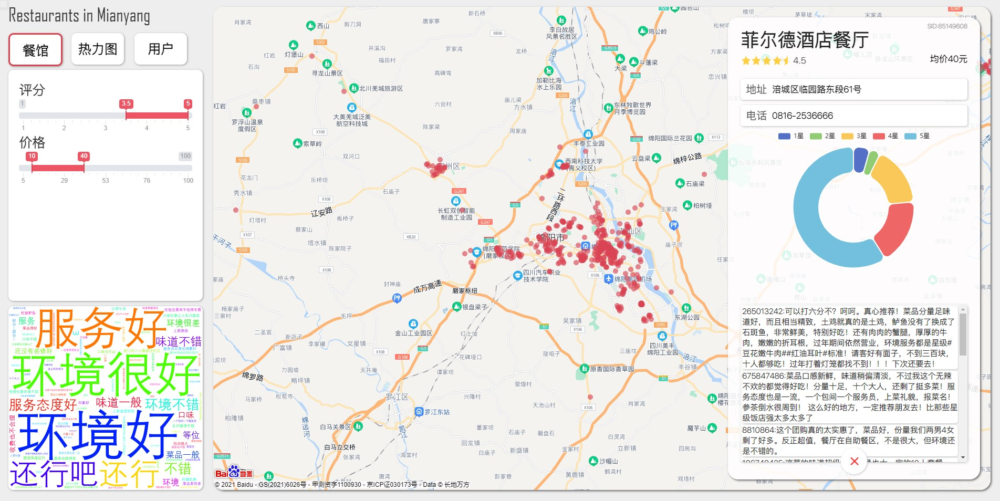

# 餐饮类消费数据的可视分析系统

可视化小组作业，基于Flask,jquery,echarts，  环境` Ubuntu 20 LTS ` , ` python 3.8 ` ,分辨率1920x1080,未适配其他分辨率。 


依赖安装：
```bash
pip3 install flask
pip3 install wordcloud
```

运行:
```bash
cd Vis/src
python3 server.py
```
浏览器输入` http://127.0.0.1:5000 `




使用到的组件：
[Ion.RangeSlider](https://github.com/IonDen/ion.rangeSlider)